# MEFS测试网使用

[TOC]

## 获取账号

//todo

## 获取mefs镜像

将docker镜像pull下来

```shell
$ docker pull memoio/mefs
```

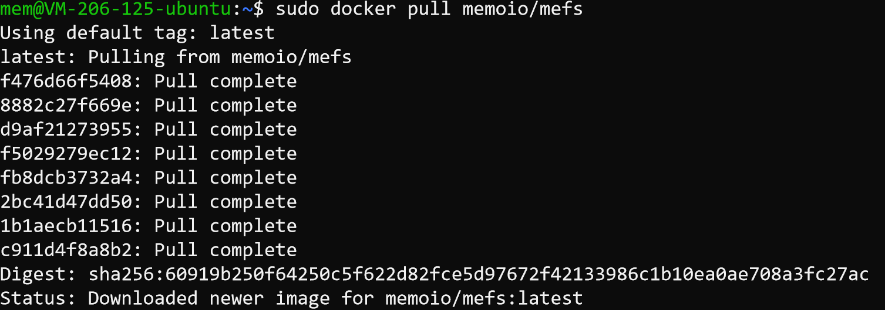

## 启动docker

+ 启动docker

```shell
$sudo docker run -itd -v /home/mem/mefs-run:/root/.mefs -p 5001:5001 memoio/mefs
```

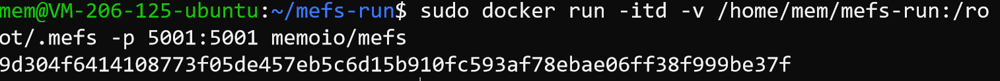

+ 进入终端

```shell
$sudo docker exec -it 9d304 bash
```
  


+ 运行mefs lfs，检查是否安装成功

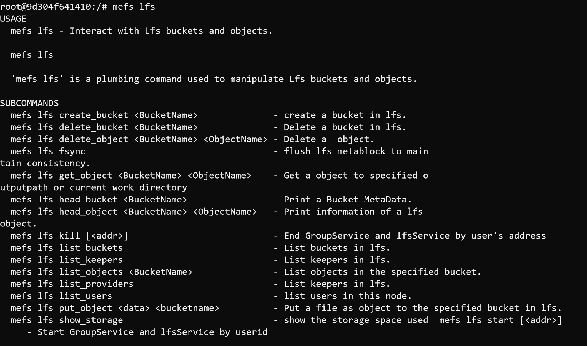

## mefs使用

每个命令的参数解释见[使用文档](https://github.com/memoio/docs)

+ mefs初始化

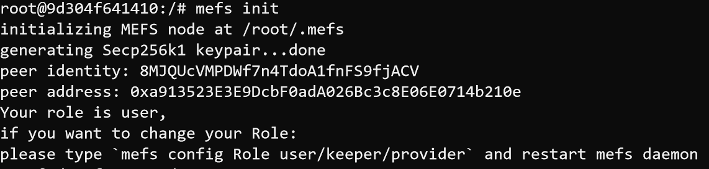

+ 启动mefs的网络实例，可后台运行

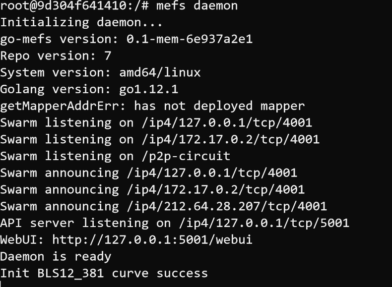

### 用户空间lfs的使用

+ 启动用户

这里的地址即为第一步获取的地址，启动期间由于需要匹配合约，部署合约，耗时约10分钟

```shell
mefs lfs start 用户地址 --sk=地址对应的私钥
```

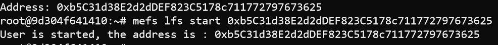


+ 创建桶

可以在该用户的加密存储空间lfs中新建bucket，policy=1为纠删码，2为多副本。

```shell
mefs lfs create_bucket bucket01 --addr=用户地址
mefs lfs create_bucket bucket01 --policy=2 --addr=用户地址
```

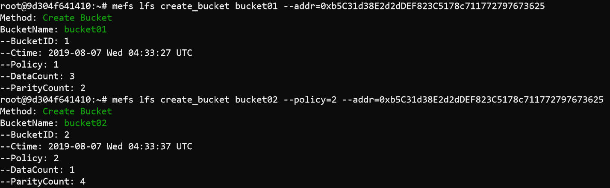

+ 上传测试文件

```shell
$mefs lfs put_object test.dat bucket01 --addr=用户地址
```

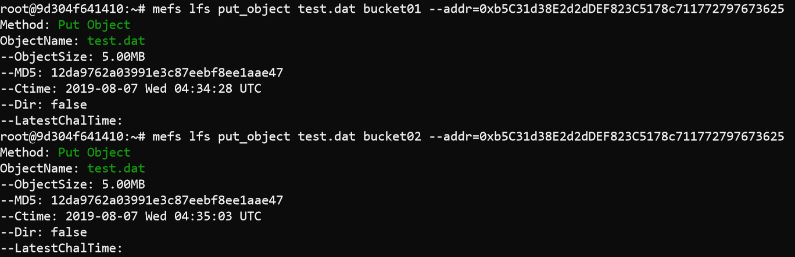

+ 下载文件，检验md5值是否正确

```shell
mefs lfs get_object bucket02 test.dat --addr=用户地址
```

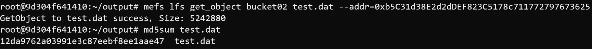

+ 查看lfs空间的信息

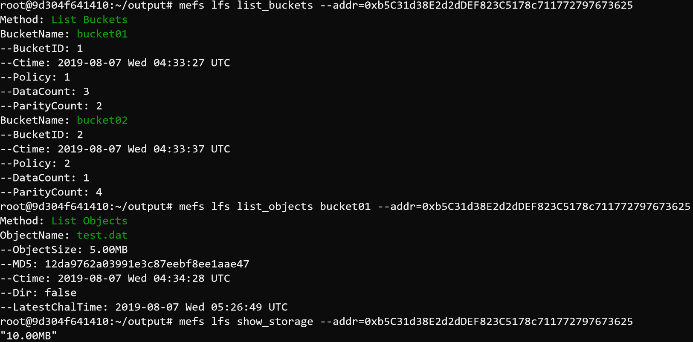

+ 检查当前的链接情况

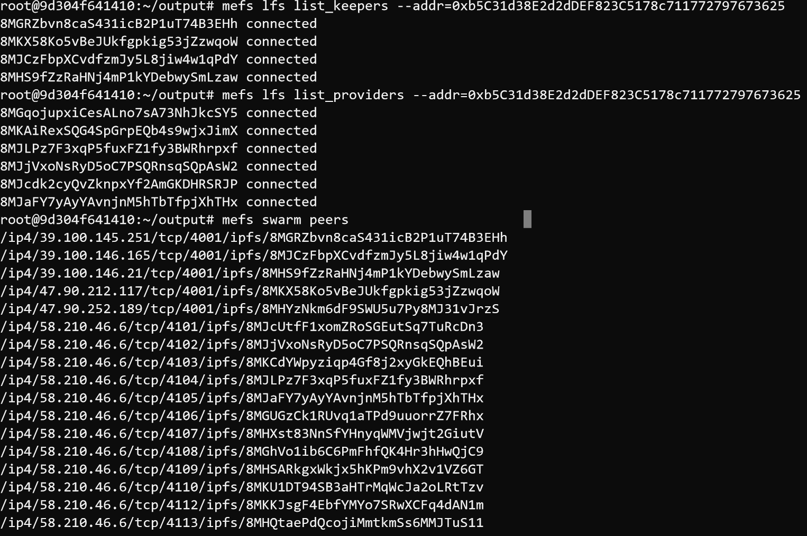


## 3. HTTP-Client使用

go接口[mefs-go-http-client](https://github.com/memoio/mefs-go-http-client)

js接口[mefs-js-http-client](https://github.com/memoio/mefs-go-http-client)